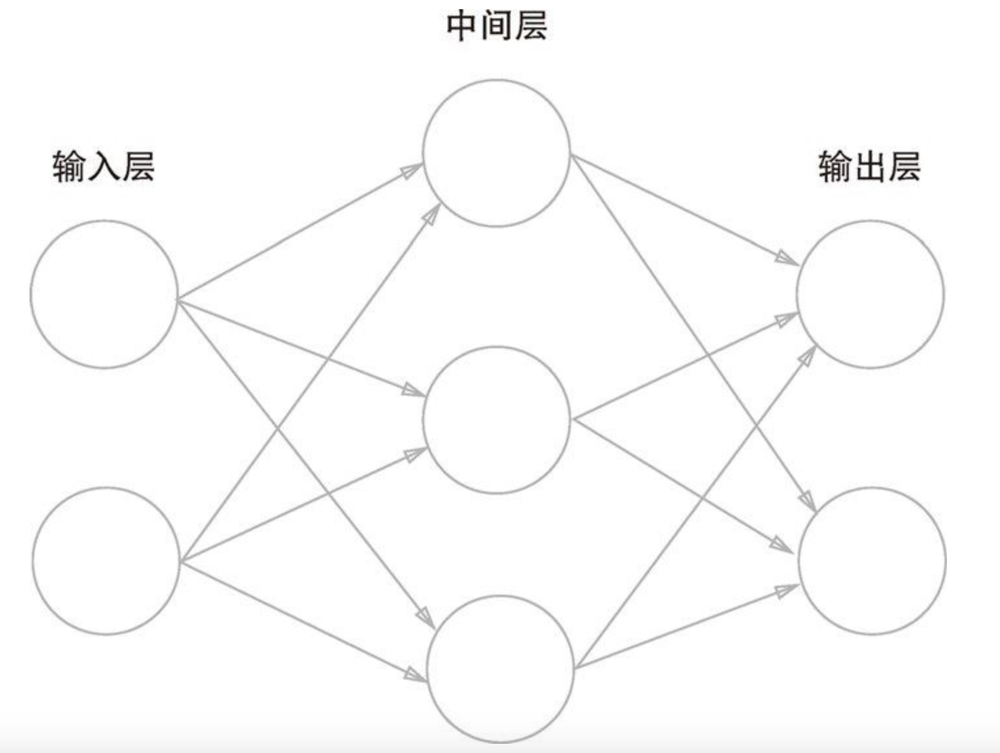
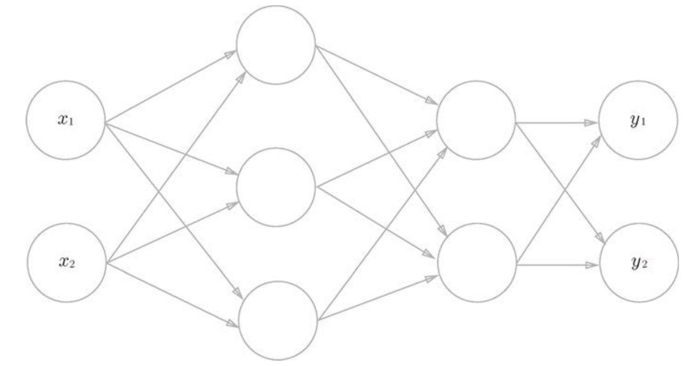

# 前言
源码地址：https://github.com/qiaohaoforever/DeepLearningFromScratch  
mnist数据集地址：https://www.kaggle.com/datasets/hojjatk/mnist-dataset/data?select=train-images-idx3-ubyte  
# 1 Python
## 1.1 NumPy

**创建数组：**
NumPy数组(np.array)可以生成N维数组，即可以生成一维数组、二维数组、三维数组等任意维数的数组。
- 数学上将一维数组称为向量，将二维数组称为矩阵。
- 可以将一般化之后的向量或矩阵等统称为张量(tensor)
- 本书基本上将二维数组称为“矩阵”，将三维数组及三维以上的数组称为“张量”或“多维数组

**广播：**


**总结：**
- Python等动态类型语言一般比C和C++等静态类型语言（编译型语言）运算速度慢。实际上，如果是运算量大的处理对象，用C/C++写程序更好。
- 为此，当Python中追求性能时，人们会用C/C++来实现处理的内容。Python则承担“中间人”的角色，负责调用那些用C/ C++写的程序。
- NumPy中，主要的处理也都是通过C或C++实现的。因此，我们可以在不损失性能的情况下，使用Python便利的语法。

## 1.2 Matplotlib

# 2 感知机
## 2.1 感知机是什么
感知机是由美国学者Frank Rosenblatt在1957年提出来的，也是作为神经网络（深度学习）的起源的算法。  
感知机接收多个输入信号，输出一个信号，感知机的信号只有“流/不流”(1/0)两种取值。在本书中，0对应“不传递信号”，1对应“传递信号”。
一个接收两个输入信号的感知机的例子：
- x1、x2是输入信号，y是输出信号，w1、w2是权重（w是weight的首字母）
- 图中的○称为“神经元”或者“节点”。  
- 输入信号被送往神经元时，会被分别乘以固定的权重(w1x1、w2x2)。神经元会计算传送过来的信号的总和，只有当这个总和超过了某个界限值时，才会输出1。这也称为“神经元被激活”。这里将这个界限值称为阈值，用符号θ表示

感知机公式如下：


## 2.2 简单逻辑电路
与门真值表如下：

考虑用感知机来表示这个与门，需要做的就是确定能满足图真值表的w1、w2、θ的值。比如(w1,w2,θ)=(0.5,0.5,0.8)或(1,1,1)等，都可以满足真值表的输入和输出。  
- 这里决定感知机参数的并不是计算机，而是我们人。我们看着真值表这种“训练数据”，人工考虑（想到）了参数的值。  
- 而机器学习的课题就是将这个决定参数值的工作交由计算机自动进行。  
- **学习是确定合适的参数的过程，而人要做的是思考感知机的构造（模型），并把训练数据交给计算机**。
## 2.3 感知机的实现
与门的Python实现
```python
def AND(x1, x2):
    w1, w2, theta = 0.5, 0.5, 0.8
    tmp = x1*w1 + x2*w2
    if tmp <= theta:
        return 0
    elif tmp > theta:
        return 1
```
另外一种实现形式：  

此处，b称为偏置，w1和w2称为权重。感知机会计算输入信号和权重的乘积，然后加上偏置，如果这个值大于0则输出1，否则输出0  
对应的与门实现：  
```python
def AND(x1, x2):
    X = np.array([x1, x2])
    w = np.array([0.5, 0.51)
    b = -0.8
    tmp = np.sum(w*x) + b
    if tmp <= O:
        return 0
    else:
        return 1
```
请注意，偏置b和权重w1、w2的作用是不一样的。具体地说，w1和w2是控制输入信号的重要性的参数，而偏置b是调整神经元被激活的容易程度（输出信号为1的程度）的参数。  
比如，若b为-0.1，则只要输入信号的加权总和超过0.1，神经元就会被激活。但是如果b为-20.0，则输入信号的加权总和必须超过20.0，神经元才会被激活。
## 2.4 感知机的局限性
感知机可以实现与门、与非门、或门三种逻辑电路，但是实现不了异或门。  
### 2.4.1 或门分析
真值表如下：

当权重参数分别为(b,w1,w2)=(-0.5,1,1)时，可满足上述真值表，感知机公式如下：

感知机会生成由直线 -0.5 + x1 + x2 = 0 分割开的两个空间。其中一个空间输出1，另一个空间输出0，如下图所示：

或门在(x1,x2)=(0,0)时输出0，在(x1,x2)为(0, 1)、(1, 0)、(1, 1)时输出1，图中○表示0，△表示1
### 2.4.2 异或门分析
真值表如下：

异或门中，无法用一条直线是将○和△分开：

### 2.4.3 线性和非线性
**感知机的局限性就在于它只能表示由一条直线分割的空间，弯曲的曲线无法用感知机表示**。另外，**由曲线分割而成的空间称为非线性空间，由直线分割而成的空间称为线性空间**。


## 2.5 多层感知机
感知机的局限性，严格地讲，应该是“单层感知机无法表示异或门”或者“单层感知机无法分离非线性空间”。通过组合感知机（叠加层）可以实现异或门。  

组合后的真值表：

多层感知机表示异或门：

异或门是一种多层结构的神经网络。这里，将最左边的一列称为第0层，中间的一列称为第1层，最右边的一列称为第2层。  
**实际上，与门、或门是单层感知机，而异或门是2层感知机。叠加了多层的感知机也称为多层感知机(multi-layered perceptron)。**  
上述感知机总共由3层构成，但是因为拥有权重的层实质上只有2层（第0层和第1层之间，第1层和第2层之间），所以称为“2层感知机”。不过，有的文献认为上图感知机是由3层构成的，因而将其称为“3层感知机”。  
2层感知机中，先在第0层和第1层的神经元之间进行信号的传送和接收，然后在第1层和第2层之间进行信号的传送和接收，
- 01.第0层的两个神经元接收输入信号，并将信号发送至第1层的神经元。
- 02.第1层的神经元将信号发送至第2层的神经元，第2层的神经元输出y。
通常，**单层感知机无法表示的东西，通过增加一层就可以解决**
## 2.6 从与非门到计算机
建议有兴趣的读者看一下《计算机系统要素：从零开始构建现代计算机》。  
思路：实际上，在用与非门等低层的元件构建计算机的情况下，分阶段地制作所需的零件（模块）会比较自然，即先实现与门和或门，然后实现半加器和全加器，接着实现算数逻辑单元(ALU)，然后实现CPU。  
因此，通过感知机表示计算机时，使用叠加了多层的构造来实现是比较自然的流程。  
感知机通过叠加层能够进行非线性的表示，理论上还可以表示计算机进行的处理。  
## 2.7 感知机总结
- 感知机是具有输入和输出的算法。给定一个输入后，将输出一个既定的值。s
- 感知机将权重和偏置设定为参数。·使用感知机可以表示与门和或门等逻辑电路。
- 异或门无法通过单层感知机来表示。·使用2层感知机可以表示异或门。
- 单层感知机只能表示线性空间，而多层感知机可以表示非线性空间。
- 多层感知机（在理论上）可以表示计算机。

# 3 神经网络
## 3.1 从感知机到神经网络
### 3.1.1 神经网络的基本概念

- 输入层：最左边的一列
- 中间层或隐藏层：中间的一列
- 输出层：最右边的一列  
上图有3层神经元，但是只有2层神经元有权重：
- 根据神经元层数命名：3层神经网络
- 根据有权重的神经元层数：2层神经网络

### 3.1.2 复习感知机

上述感知机可用函数表示为：

**b是被称为偏置的参数，用于控制神经元被激活的容易程度；而w1和w2是表示各个信号的权重的参数，用于控制各个信号的重要性**

## 3.2 激活函数

感知机的公式可转换为如下：
```python
a = b + w1x1 + w2x2
y = h(a)
```
h(x)函数会将输入信号的总和转换为输出信号，这种函数一般称为激活函数(activation function)。**激活函数的作用在于决定如何来激活输入信号的总和**  
上图表示神经元的○中明确显示了激活函数的计算过程，即信号的加权总和为节点a，然后节点a被激活函数h()转换成节点y  
### 3.2.1 阶跃函数
激活函数以阈值为界，一旦输入超过阈值，就切换输出。这样的函数称为“阶跃函数”。

阶跃函数以0为界，输出从0切换为1（或者从1切换为0）。它的值呈阶梯式变化，所以称为阶跃函数。 
### 3.2.2 sigmoid函数
自然数 ( e )（也称为欧拉数或纳皮尔常数）是数学中最重要的常数之一，大约等于 2.71828。它是一个无理数（无限不循环小数），也是超越数（不能表示为有理系数多项式的根）  


```python
# 指数为负数时的计算方法是：a的负n次方等于a的n次方的倒数。
def sigmoid(x):
    return 1 / (1 + np.exp(-x))

def test_sigmoid():
    x = np.array([-1.0, 1.0, 2.0])
    print(sigmoid(x))

if __name__ == '__main__':
    test_sigmoid()
# 输出: [0.26894142 0.73105858 0.88079708]
```
sigmoid函数图形如下：  


阶跃函数和sigmoid函数的区别  
- 平滑性不同：sigmoid函数是一条平滑的曲线，输出随着输入发生连续性的变化。而阶跃函数以0为界，输出发生急剧性的变化。sigmoid函数的平滑性对神经网络的学习具有重要意义
- 返回值不同：阶跃函数只能返回0或1，sigmoid函数可以返回0.731...、0.880 ...等实数。感知机中神经元之间流动的是0或1的二元信号，而神经网络中流动的是连续的实数值信号。
- 比喻：阶跃函数可以比作“竹筒敲石”，sigmoid函数可以比作“水车”。阶跃函数就像竹筒敲石一样，只做是否传送水（0或1）两个动作，而sigmoid函数就像水车一样，根据流过来的水量相应地调整传送出去的水量

阶跃函数和sigmoid函数的共同点  
- 均为非线性函数

线性函数和非线性函数的区别
- 线性函数：向这个转换器输入某个值后，输出值是输入值的常数倍的函数称为线性函数（用数学式表示为h(x) = cx。c为常数），线性函数是一条笔直的直线。
- 非线性函数：指的是不像线性函数那样呈现出一条直线的函数

激活函数为什么使用非线性函数？
- 使用线性函数的话，加深神经网络的层数就没有意义了，线性函数的问题在于，不管如何加深层数，总是存在与之等效的“无隐藏层的神经网络”。

### 3.2.3 ReLU函数
ReLU函数在输入大于0时，直接输出该值；在输入小于等于0时，输出0  
函数图形如下：

函数公式如下：


## 3.3 多维数组的运算
### 3.3.1 多维数组
多维数组就是“数字的集合”，数字排成一列的集合、排成长方形的集合、排成三维状或者（更加一般化的）N维状的集合都称为多维数组  
数组的维数可以通过np.ndim()函数获得。此外，数组的形状可以通过实例变量shape获得  
```python
arr = np.array([[1, 3, 5], [2, 4, 6]])
print(arr.shape) # (2, 3)
print(arr.ndim) # 2
```
### 3.3.2 矩阵乘法
二维数组也称为矩阵(matrix),数组的横向排列称为行(row)，纵向排列称为列(column)。矩阵的乘积计算方法如下：

- 矩阵的乘积是通过左边矩阵的行（横向）和右边矩阵的列（纵向）以对应元素的方式相乘后再求和而得到的。运算的结果保存为新的多维数组的元素。  
- 比如，A的第1行和B的第1列的乘积结果是新数组的第1行第1列的元素，A的第2行和B的第1列的结果是新数组的第2行第1列的元素

在矩阵的乘积运算中，对应维度的元素个数要保持一致:  


矩阵的乘积可以通过NumPy的np.dot()函数计算（乘积也称为点积）。np.dot()接收两个NumPy数组作为参数，并返回数组的乘积。
```python
arr_x = np.array([1, 2])
arr_w = np.array([[1, 3, 5], [2, 4, 6]])
arr_y = np.dot(arr_x, arr_w)
print(arr_y.shape) # (3,)
print(arr_y.ndim) # 1
```
### 3.3.3 神经网络的内积
下图的神经网络省略了偏置和激活函数，只有权重  

代码如下：
```python
arr_x = np.array([1, 2])
arr_w = np.array([[1, 3, 5], [2, 4, 6]])
arr_y = np.dot(arr_x, arr_w)
print(arr_y) # [ 5 11 17]
print(arr_y.shape) # (3,)
print(arr_y.ndim) # 1
```
## 3.4 三层神经网络的实现
有3层神经网络如下：

- 输入层（第0层）有2个神经元
- 第1个隐藏层（第1层）有3个神经元，第2个隐藏层（第2层）有2个神经元
- 输出层（第3层）有2个神经元  
巧妙地使用NumPy数组，可以用很少的代码完成神经网络的前向处理（输入到输出的处理）  
### 3.4.1 符号确认

### 3.4.2 各层间信号传递的实现
从输入层到第1层的信号传递：

第1层到第2层的信号传递：

从第2层到输出层的信号传递：

注意：输出层的激活函数用σ()表示，不同于隐藏层的激活函数h()（σ读作sigma），要根据求解问题的性质决定：
- 回归问题可以使用恒等函数，恒等函数会将输入按原样输出
- 二元分类问题可以使用sigmoid函数
- 多元分类问题可以使用softmax函数  
### 3.4.3 代码实现
```python
import numpy as np

# 激活函数
def sigmoid(x):
    return 1 / (1 + np.exp(-x))

def identity_function(x):
    return x

def init_network():
    network = {}
    # 构造第一层权重
    network["W1"] = np.array([[0.1, 0.3, 0.5], [0.2, 0.4, 0.6]])
    network["b1"] = np.array([0.1, 0.2, 0.3])

    # 构造第二层权重
    network["W2"] = np.array([[0.1, 0.4], [0.2, 0.5], [0.3, 0.6]])
    network["b2"] = np.array([0.1, 0.2])

    # 构造第三层权重
    network["W3"] = np.array([[0.1, 0.3], [0.2, 0.4]])
    network["b3"] = np.array([0.1, 0.2])

    return network

def forward(network, x):
    """
    神经网络前向处理：输入 -> 输出
    :param network:
    :param x:
    :return:
    """
    W1, W2, W3 = network["W1"], network["W2"], network["W3"]
    b1, b2, b3 = network["b1"], network["b2"], network["b3"]
    a1 = np.dot(x, W1) + b1
    z1 = sigmoid(a1)
    a2 = np.dot(z1, W2) + b2
    z2 = sigmoid(a2)
    a3 = np.dot(z2, W3) + b3
    y = identity_function(a3)
    return y

if __name__ == '__main__':
    network = init_network()
    x = np.array([1.0, 0.5])
    y = forward(network, x)
    print(y) # [0.31682708 0.69627909]
```
## 3.5 输出层的设计
### 3.5.1 机器学习的问题分类
- 分类问题：是数据属于哪一个类别的问题。比如，区分图像中的人是男性还是女性的问题就是分类问题
- 回归问题：是根据某个输入预测一个（连续的）数值的问题。比如，根据一个人的图像预测这个人的体重的问题就是回归问题（类似“57.4kg”这样的预测）。
### 3.5.2 恒等函数和softmax函数
恒等函数会将输入按原样输出，对于输入的信息，不加以任何改动地直接输出。因此，在输出层使用恒等函数时，输入信号会原封不动地被输出：
  
分类问题中使用的softmax函数：
  
softmax函数的分子是输入信号ak的指数函数，分母是所有输入信号的指数函数的和  
softmax函数的输出通过箭头与所有的输入信号相连，输出层的各个神经元都受到所有输入信号的影响，如下图所示：


### 3.5.3 softmax函数代码实现
softmax函数代码实现：
```python
def softmax(a):
    exp_a = np.exp(a)
    sum_exp_a = np.sum(exp_a)
    y = exp_a / sum_exp_a
    return y

a = np.array([0.3, 2.9, 4.0])
print(softmax(a)) # [0.01821127 0.24519181 0.73659691]
```
上述实现中要进行指数函数的运算，但是此时指数函数的值很容易变得非常大，这个缺陷就是溢出问题。优化版本如下：
```python
def softmax(a):
    c = np.max(a)
    exp_a = np.exp(a - c) # 溢出策略
    sum_exp_a = np.sum(exp_a)
    y = exp_a / sum_exp_a
    return y
a = np.array([1010, 1000, 990])
print(softmax(a)) # [9.99954600e-01 4.53978686e-05 2.06106005e-09]
```
### 3.5.4 softmax函数的特征
- softmax函数的输出是0.0到1.0之间的实数，并且softmax函数的输出值的总和是1，**因此把softmax函数的输出解释为“概率”**。

机器学习问题的步骤可以分为“学习”和“推理”两个阶段：
- 学习阶段：进行模型的学习
- 推理阶段：用学到的模型对未知的数据进行推理（分类）
### 3.5.5 输出层的神经元数量
输出层的神经元数量需要根据待解决的问题来决定
- 对于分类问题，输出层的神经元数量一般设定为类别的数量。比如，对于某个输入图像，预测是图中的数字0到9中的哪一个的问题（10类别分类问题），可将输出层的神经元设定为10个  

数字分类案例：

图中输出层的神经元的值用不同的灰度表示。这个例子中神经元y2颜色最深，输出的值最大。这表明这个神经网络预测的是y2对应的类别，也就是“2”。
## 3.6 手写数字识别
神经网络解决问题的步骤：
- 学习阶段：使用训练数据（学习数据）进行权重参数的学习
- 推理阶段：使用刚才学习到的参数，对输入数据进行分类
### 3.6.1 MNIST数据集
MNIST手写数字图像集。MNIST是机器学习领域最有名的数据集之一，被应用于从简单的实验到发表的论文研究等各种场合  
- MNIST数据集是由0到9的数字图像构成的：训练图像有6万张，测试图像有1万张，这些图像可以用于学习和推理
- MNIST数据集的一般使用方法是，先用训练图像进行学习，再用学习到的模型度量能在多大程度上对测试图像进行正确的分类
- MNIST的图像数据是28像素×28像素的灰度图像（1通道），各个像素的取值在0到255之间。每个图像数据都相应地标有“7”、“2”、“1”等标签。
  
### 3.6.2 神经网络的推理处理
**类似于3.4 三层神经网络的实现**  

- init_network()会读入保存在pickle文件sample_weight.pkl中的学习到的权重参数
**单条数据处理：**


**批量数据处理：**

