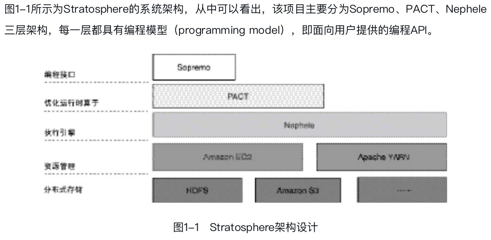

# 1 Flink基本设计思想
## 1.1 Stratosphere系统架构

基于Stratosphere原有架构，吸收**DataFlow编程模型**及**分布式异步快照算法Chandy-Lamport**等思想，Flink实现了高效兼容离线及流式数据处理

## 1.2 DataFlow模型的设计思想
DataFlow是Google提出的编程模型，旨在提供一种统一批处理和流处理的系统，目前已经应用于Google Cloud。核心点如下：
- 无界、有界与流处理、批处理：描述无限和有限数据集时，人们更愿意使用无界和有界这样的描述，而不是流处理数据和批处理数据，这是因为流处理和批处理意味着使用特定的执行引擎
- 窗口计算：提供了3种窗口计算类型，固定窗口（fixed）、固定窗口（fixed）、固定窗口（fixed）
- 时间域与水位线机制：时间域分为两种类型，即事件时间（event time）和处理时间（processing time），

结论：数据处理的未来是无界数据处理，尽管有界数据处理十分重要，但是在语义上会被无界数据处理模型涵盖。Google提出了很多新的概念，这些概念很快被一些优秀的项目实现，包括谷歌内部的MillWheel引擎、开源框架Flink

相关架构：
- lamda架构说白了就是公司的离线和实时处理技术走两条线，离线的专门做离线数据处理（例如使用hive，impala，presto，sparkSQL等各种OLAP的技术框架），实时的就专门使用实时处理技术（例如storm，sparkStreaming，flink流处理程序等）
- Kappa架构去掉了批处理层这一体系结构，核心思想是通过改进流计算系统来解决数据全量处理的问题，使得实时计算和批处理过程使用同一套代码。

参考：https://blog.csdn.net/Shockang/article/details/131955682

## 1.3 分布式异步快照算法
1、Chandy-Lamport算法设计
简单来说就是用来在缺乏类似全局时钟或者全局时钟不可靠的分布式系统中来确定一种全局状态。
参考：https://zhuanlan.zhihu.com/p/53482103 、 https://juejin.cn/post/7075652881302421541

存在的问题：
- 在Chandy-Lamport算法中，为了实现全局状态一致，需要停止流处理程序，直到快照完成，这会对系统性能有非常大的影响
- 在Chandy-Lamport算法中，为了实现全局状态一致，需要停止流处理程序，直到快照完成，这会对系统性能有非常大的影响

2、异步屏障快照（Asynchronous Barrier Snapshotting，ABS）算法改进
核心思想是在input source节点插入barrier事件，替代Chandy-Lamport算法中的marker，通过控制barrier事件同步实现快照备份，最终实现Exactly-Once语义

