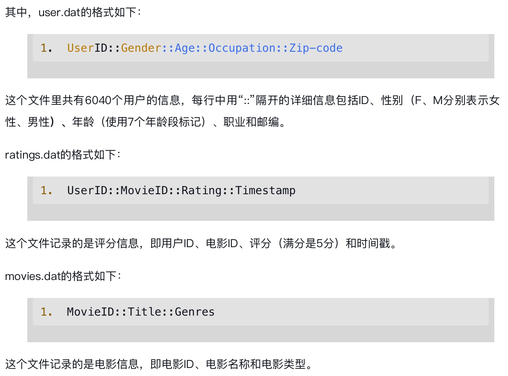

# 第1章 电光石火间体验Spark2.4开发实战
预置数据：
案例中使用的是用户观看电影和点评电影的行为数据，数据来源于网络上的公开数据，共有3个数据文件：user.dat、ratings.dat和movies.dat
推荐系统--MovieLens数据集下载：https://blog.csdn.net/weixin_42727538/article/details/124364700


## 1.1 RDD
```scala
// 从内存中创建RDD
val data = List(1, 2, 3, 4, 5)
// parallelize：并行
val rdd = spark.sparkContext.parallelize(data)
// makeRDD方法在底层实现其实就是调用的rdd对象的parallelize方法
val rdd1 = spark.sparkContext.makeRDD(data)

// 从文件中创建RDD
val dataPath = "./spark/ml-1m/"
val usersRDD = sc.textFile(dataPath + "users.dat")
```

## 1.2 通过DataFrame和DataSet实战电影点评系统
- DataFrame：类似于传统数据库中的二维表格。DataFrame与RDD的主要区别在于，前者带有schema元信息，即DataFrame表示的二维表数据集的每一列都带有名称和类型。
- DataSet：API是从1.6版本提出的，在Spark 2.2的时候，DataSet和DataFrame趋于稳定，可以投入生产环境使用。与DataFrame不同的是，DataSet是强类型的，而DataFrame实际上就是DataSet[Row]（也就是Java中的DataSet<Row>）
- 反观RDD，由于无从得知其中数据元素的具体内部结构，故很难被Spark本身自行优化，对于新手用户很不友好，但是，DataSet底层是基于RDD的，所以最终的优化尽头还是对RDD的优化，这就意味着优化引擎不能自动优化的地方，用户在RDD上可能有机会进行手动优化

在Scala中，case class 是一种特殊的类，它被设计用来保存不可变的数据;case class 的实例是不可变的，这意味着一旦创建了 case class 的实例，你就不能改变它的状态
```scala
case class Person(name: String, age: Int)
val person = Person("Alice", 25)
```

**隐式转换：**
- 在 Apache Spark 中，SparkSession 是用于与 Spark SQL 进行交互的主要入口点。
- 在 Scala 中，SparkSession 提供了一个名为 implicits 的对象，它包含了一些隐式转换，用于将常见的 Scala 数据类型（如序列、RDD 等）转换为 Spark SQL 的 DataFrame 和 Dataset
- 导入 implicits：要使用这些隐式转换，必须首先导入 spark.implicits._，其中 spark 是 SparkSession 的实例
- 作用域：implicits 只在 SparkSession 的上下文中可用，因此需要在使用 Spark SQL 的代码中确保正确导入。

前面提到的DataFrame其实就是DataSet[Row]，所以只要学会了DataFrame的使用，就可以快速接入DataSet，只不过在创建DataSet的时候要注意与创建DataFrame的方式略有不同。DataSet可以由DataFrame转换而来，只需要用yourDataFrame.as[yourClass]即可得到封装了yourClass类型的DataSet，之后就可以像操作DataFrame一样操作DataSet了
```scala
// ================== 创建DataFrame =================
// 数据格式化：在RDD的基础上增加数据的元数据信息
val schemaforratings = StructType("UserID::MovieID".split("::").map(column => StructField(column, StringType, true)))
  .add("Rating", DoubleType, true)
  .add("TimeStamp", StringType, true)
val ratingsRDDRows = ratingsRDD
  .map(_.split("::"))
  .map(line => Row(line(0).trim, line(1).trim, line(2).trim.toDouble, line(3).trim))
val ratingsDataFrame= spark.createDataFrame(ratingsRDDRows, schemaforratings)

// ================== 创建DataSet =================
case class User(UserId:String, Gender:String, Age:String, OccupationID:String, zipCode:String)
import spark.implicits._
// 创建用户DataSet
val usersForDSRDD = usersRDD
  .map(_.split("::"))
  .map(line => User(line(0).trim, line(1).trim, line(2).trim, line(3).trim, line(4).trim))
val usersDataSet = spark.createDataset(usersForDSRDD)
```
源码实现: DataFrame就是数据类型为Row的Dataset
```scala
type DataFrame = Dataset[Row]
```
## 1.3 spark cache方法
作用：
- cache 方法用于将数据集（如 RDD、DataFrame 或 Dataset）存储在内存中，以便后续的操作可以更快地访问这些数据。这在需要多次遍历相同数据集时特别有用，因为它可以显著减少重复计算的开销
```scala
import org.apache.spark.sql.SparkSession

// 创建一个 SparkSession
val spark = SparkSession.builder()
  .appName("CacheExample")
  .master("local[*]")
  .getOrCreate()

import spark.implicits._

// 创建一个 DataFrame
val df = spark.read.json("path/to/json/file")

// 缓存 DataFrame
df.cache()

// 第一次操作会触发缓存
df.count()

// 后续的操作将更快，因为数据已缓存
df.filter($"age" > 21).show()
```

RDD的cache与DataSet方法的区别：
- RDD的cache方法等于MEMORY_ONLY级别的persist
- DataSet的cache方法等于MEMORY_AND_DISK级别的persist
```scala
/**
* Persist this RDD with the default storage level (`MEMORY_ONLY`).
*/
def cache(): this.type = persist()

/**
* Persist this Dataset with the default storage level (`MEMORY_AND_DISK`).
*
* @group basic
* @since 1.6.0
*/
def cache(): this.type = persist()
```
## 1.4 其他
基于DataSet的计算会像SQL一样被Catalyst引擎解析生成执行查询计划

## 1.5 源码环境搭建
spark下载地址：https://spark.apache.org/downloads.html
下载spark-2.4.3.tgz：https://archive.apache.org/dist/spark/spark-2.4.3/
基本框架入口：
```text
启动集群：sbin/start-all.sh
    启动master：sbin/start-master.sh，对应类名为org.apache.spark.deploy.master.Master，从onStart方法开始启动
    启动worker：sbin/start-worker.sh，对应类名为org.apache.spark.deploy.worker.Worker，从onStart方法开始启动

提交任务：bin/spark-submit
    启动类：org.apache.spark.deploy.SparkSubmit，从main方法开始
```

# 第2章 Spark 2.4技术及原理
Spark 2.0中更新发布了新的流处理框架（Structured Streaming）：
- 对于API的更新，Spark 2.0版本API的更新主要包括DataFrame、DataSet、SparkSession、累加器API、Aggregator API等API的变动
## 2.1 spark 2.4 core
### 2.1.1 第二代Tungsten引擎（钨丝计划）
spark 1.5版本加入的钨丝计划着手解决的问题：
- 统一内存管理模型和二进制处理（Binary Processing），代替之前基于JVM的静态内存管理，引入Page来管理堆内存和堆外内存（on-heap和off-heap），并且直接操作内存中的二进制数据。
- 基于缓存感知的计算（Cache-aware Computation），设计了缓存友好的算法和数据结构来提高缓存命中率，充分利用L1/L2/L3三级缓存，大幅提高了内存读取速度
- 代码生成（Code Generation），在Spark运行时动态生成用于部分算子求值的bytecode，减少了对基础数据类型的封装，并且缓解了调用虚函数的额外开销

第二代Tungsten引擎：最重要的一点是把CodeGeneration作用于全阶段的SparkSQL和DataFrame之上（即全阶段代码生成Whole Stage Code Generation），为常见的算子带来10倍左右的性能提升。

### 2.1.2 SparkSession
创建SparkSession
```scala
SparkSession.builder()
  .master("local[*]")
  .appName("Word Count")
  .config("spark.some.config.option", "some-value")
  .getOrCreate()
```
创建源码：
```scala
/**
 * Gets an existing [[SparkSession]] or, if there is no existing one, creates a new
 * one based on the options set in this builder.
 *
 * This method first checks whether there is a valid thread-local SparkSession,
 * and if yes, return that one. It then checks whether there is a valid global
 * default SparkSession, and if yes, return that one. If no valid global default
 * SparkSession exists, the method creates a new SparkSession and assigns the
 * newly created SparkSession as the global default.
 *
 * In case an existing SparkSession is returned, the config options specified in
 * this builder will be applied to the existing SparkSession.
 *
 * @since 2.0.0
 */
def getOrCreate(): SparkSession = synchronized {}
```
- 检测当前线程是否有一个已经存在的Thread-local级别的SparkSession，如果有，则返回它
- 如果没有，则检测是否有全局级别的SparkSession，有，则返回，没有，则创建新的SparkSession

### 2.1.3 累加器API
获取累加器的值：
- Executor上只能对累加器进行累加操作，只有Driver才能读取累加器的值
- Driver读取值的时候会把各个Executor上存储的本地累加器的值加起来
- 如果返回值是List，每次跑的顺序不一定相同，取决于各个Executor的值到达Driver的顺序
spark2.X版本使用案例：
```scala
// 参考MyAccumulatorDemo
```
# 第3章 Spark的灵魂：RDD和DataSet
## 3.1 为什么说RDD和DataSet是Spark的灵魂
### 3.1.1 RDD的定义及五大特性剖析
**BlockManagerMaster 和 BlockManagerSlave 是负责管理数据块（Block）存储和传输的核心组件：**
- BlockManagerMaster 是 BlockManager 的中央协调者，负责元数据管理和全局调度，运行在 Driver 节点上，负责管理集群中所有 BlockManagerSlave 的元数据信息
- BlockManagerSlave 是 BlockManager 的执行者，负责数据块的存储和传输，运行在每个 Executor 上，负责实际的数据块存储和管理。

**BlockManagerMaster 和 BlockManagerSlave 的协作：**
- 数据块注册：BlockManagerSlave 将本地数据块的元数据注册到 BlockManagerMaster。
- 数据块查找：当 Executor 需要访问数据块时，通过 BlockManagerMaster 查找数据块的位置。
- 数据块传输：BlockManagerSlave 根据 BlockManagerMaster 提供的位置信息，从远程节点获取数据块。
- 数据块复制：为了提高容错性，BlockManagerMaster 可能会指示 BlockManagerSlave 将数据块复制到其他节点

BlockManager在每个节点上运行管理Block（Driver和Executors），它提供一个接口检索本地和远程的存储变量，如memory、disk、off-heap。BlockManagerMaster会持有整个Application的Block的位置、Block所占用的存储空间等元数据信息，在Spark的Driver的DAGScheduler中，就是通过这些信息来确认数据运行的本地性的。


RDD是一个容错的、并行的数据结构，可以将数据存储到内存和磁盘中，并能控制数据分区，且提供了丰富的API来操作数据。

RDD是只读的记录分区的集合，能横跨集群所有节点并行计算，是一种基于工作集的应用抽象

**RDD底层存储原理：**
- 每个RDD的数据都以Block的形式存储于多台机器上，每个Executor会启动一个BlockManagerSlave，并管理一部分Block
- Block的元数据由Driver节点上的BlockManagerMaster保存，BlockManagerSlave生成Block后向BlockManagerMaster注册该Block
- BlockManagerMaster管理RDD与Block的关系，当RDD不再需要存储的时候，将向BlockManagerSlave发送指令删除相应的Block

**数据块Block和RDD的partition关系：**
- BlockManager管理RDD的物理分区，每个Block就是节点上对应的一个数据块，可以存储在内存或者磁盘上。
- RDD中的Partition是一个逻辑数据块，对应相应的物理块Block。本质上，**一个RDD在代码中相当于数据的一个元数据结构（一个RDD就是一组分区），存储着数据分区及其及Block、Node等逻辑结构映射关系，以及其他元数据信息，存储着RDD之前的依赖转换关系**。
- Partition分区是一个逻辑概念，Transformation前后的新旧分区在物理上可能是同一块内存存储。
